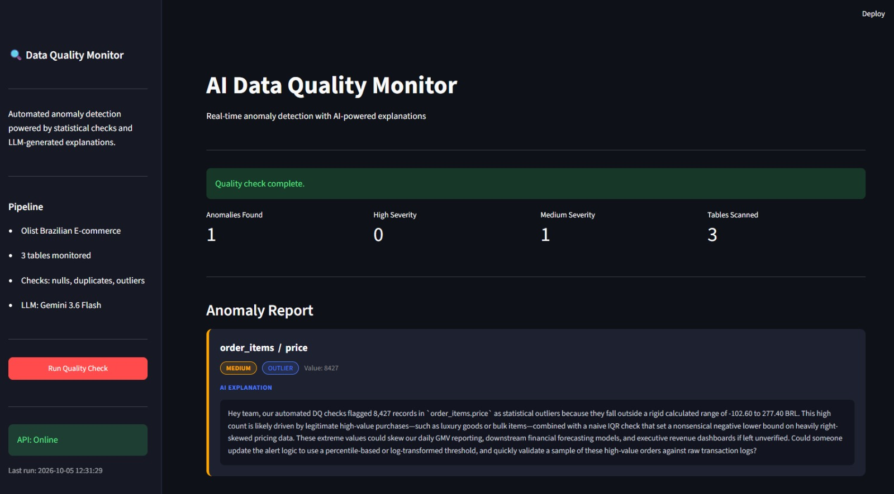
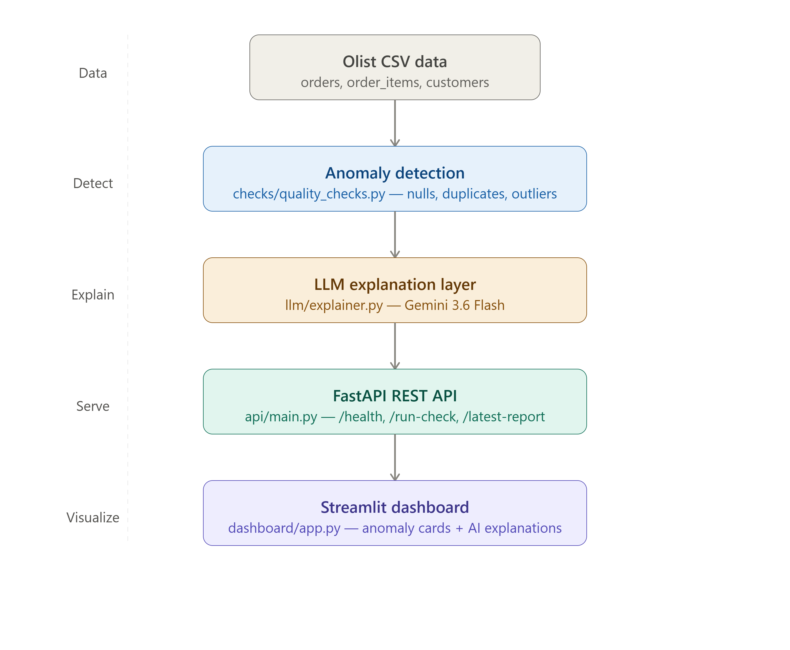

# AI Data Quality Monitor

Automated data quality monitoring pipeline for e-commerce data. Detects anomalies across multiple tables using statistical checks, then uses an LLM to generate plain-English explanations that sound like a senior data engineer wrote them.

Built on the [Olist Brazilian E-commerce dataset](https://www.kaggle.com/datasets/olistbr/brazilian-ecommerce).

---



---

## What it does

Most data quality tools tell you *that* something is wrong. This project tells you *why* it's probably wrong and *what to do about it* -- automatically.

**Detection layer:** statistical checks flag anomalies (null spikes, duplicate keys, price outliers)

**Explanation layer:** each flagged anomaly is passed to Gemini with full dataset context, and the LLM generates a Slack-style explanation a real data team would actually find useful

**API layer:** FastAPI serves the full pipeline as a REST API with 3 endpoints

**Dashboard layer:** Streamlit displays the report with severity badges and AI explanations in a dark-themed ops-style interface

---

## Architecture



---

## Tech Stack

- Python 3.12
- FastAPI + Uvicorn
- Streamlit
- Google Gemini API (google-genai)
- Pandas
- Apache Airflow (orchestration -- Docker, coming soon)
- Docker (coming soon)

---

## Anomaly Checks

| Check | Table | What it detects |
|---|---|---|
| Null spike | orders, order_items, customers | Columns exceeding 5% null threshold |
| Duplicate key | orders, order_items, customers | Duplicate rows on the correct unique key per table |
| Price outlier (IQR) | order_items | Prices outside 1.5x IQR range |

---

## API Endpoints

| Method | Endpoint | Description |
|---|---|---|
| GET | /health | Returns API status and last run time |
| POST | /run-check | Runs all checks + generates LLM explanations |
| GET | /latest-report | Returns the most recent report without re-running |

Interactive API docs available at `http://127.0.0.1:8000/docs` when running locally.

---

## Sample LLM Output

> "Hey team, our automated DQ checks flagged 8,427 records in order_items.price as statistical outliers because they fall outside our IQR-based range. This is likely driven by legitimate high-value purchases such as luxury goods or bulk items, combined with a naive IQR threshold that produces a nonsensical negative lower bound on heavily right-skewed pricing data. These extreme values could skew our GMV reporting and downstream financial forecasting models. Could someone update the alert logic to use a percentile-based or log-transformed threshold, and validate a sample of these high-value orders against raw transaction logs?"

---

## How to Run Locally

**1. Clone the repo**
```bash
git clone https://github.com/Tarooba05/ai-data-quality-monitor.git
cd ai-data-quality-monitor
```

**2. Create and activate a virtual environment**
```bash
python -m venv venv
venv\Scripts\activate  # Windows
```

**3. Install dependencies**
```bash
pip install -r requirements.txt
```

**4. Set up environment variables**

Create a `.env` file in the project root:

GOOGLE_API_KEY=your_google_ai_studio_key_here

Get a free API key at [aistudio.google.com](https://aistudio.google.com)

**5. Add the dataset**

Download the [Olist dataset from Kaggle](https://www.kaggle.com/datasets/olistbr/brazilian-ecommerce) and place the CSV files in:

data/Brazillion Ecommerce/


**6. Start the API**
```bash
uvicorn api.main:app --reload
```

**7. Start the dashboard (new terminal)**
```bash
streamlit run dashboard/app.py
```

Open `http://localhost:8501` in your browser.

---

## Project Structure

```
ai-data-quality-monitor/
├── api/
│   └── main.py          # FastAPI app with 3 endpoints
├── checks/
│   └── quality_checks.py # Anomaly detection functions
├── dashboard/
│   └── app.py           # Streamlit dashboard
├── llm/
│   └── explainer.py     # Gemini LLM explanation layer
├── data/                # Olist CSVs (not committed)
├── notes/               # Exploration findings
├── assets/              # Screenshots
└── requirements.txt
```

---

## Author

Tarooba Ahmed -- www.linkedin.com/in/tarooba-ahmed-898024290 -- [\[GitHub URL\]](https://github.com/Tarooba05)
